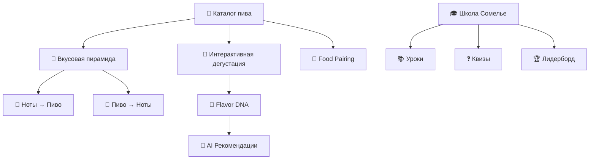

# 🍺 Дерево Вкусов | Flavor Tree

> ### 🔥 Слоган
> ## *«Не пей — слушай вкус»*
>
> *(Don't just drink — listen to the flavor)*

---

## 📂 Структура проекта

```
efesccl/
│
├── 📄 README.md                          # Описание проекта, стек, как запустить
├── 📄 PROJECT_TREE.md                    # ← этот файл
├── 📄 .gitignore
├── 📄 docker-compose.yml                 # Оркестрация сервисов (backend + frontend + db)
│
├── 📁 docs/                              # Документация проекта
│   ├── 📄 pitch_deck.md                  # Структура презентации (EN)
│   ├── 📄 research.md                    # Ресёрч рынка, конкуренты, научная база
│   ├── 📄 business_model.md              # Бизнес-модель (B2B + B2C)
│   ├── 📄 flavor_pyramid.md              # Концепция вкусовой пирамиды (Top/Heart/Base)
│   └── 📄 qa_defense.md                  # Готовые ответы на Q&A жюри
│
├── 📁 backend/                           # Django REST API
│   ├── 📄 manage.py
│   ├── 📄 requirements.txt
│   ├── 📄 Dockerfile
│   │
│   ├── 📁 config/                        # Настройки Django-проекта
│   │   ├── 📄 __init__.py
│   │   ├── 📄 settings.py
│   │   ├── 📄 urls.py
│   │   ├── 📄 wsgi.py
│   │   └── 📄 asgi.py
│   │
│   ├── 📁 apps/
│   │   │
│   │   ├── 📁 beers/                     # 🍺 Каталог пива
│   │   │   ├── 📄 models.py              #   Beer, Brand, Style
│   │   │   ├── 📄 serializers.py
│   │   │   ├── 📄 views.py               #   CRUD + фильтрация
│   │   │   ├── 📄 urls.py
│   │   │   ├── 📄 admin.py
│   │   │   └── 📄 tests.py
│   │   │
│   │   ├── 📁 flavors/                   # 🌿 Вкусовые ноты и пирамиды
│   │   │   ├── 📄 models.py              #   FlavorNote, FlavorPyramid, FlavorCategory
│   │   │   ├── 📄 serializers.py
│   │   │   ├── 📄 views.py               #   Пиво→Ноты, Ноты→Пиво (двусторонняя навигация)
│   │   │   ├── 📄 urls.py
│   │   │   └── 📄 tests.py
│   │   │
│   │   ├── 📁 profiles/                  # 👤 Вкусовой профиль пользователя
│   │   │   ├── 📄 models.py              #   UserProfile, TastePreference, FlavorDNA
│   │   │   ├── 📄 serializers.py
│   │   │   ├── 📄 views.py               #   Персональный Flavor DNA, история дегустаций
│   │   │   ├── 📄 urls.py
│   │   │   └── 📄 tests.py
│   │   │
│   │   ├── 📁 tastings/                  # 🍷 Интерактивные дегустации
│   │   │   ├── 📄 models.py              #   Tasting, UserTastingNote, TastingSession
│   │   │   ├── 📄 serializers.py
│   │   │   ├── 📄 views.py               #   «Что чувствуешь ты?» — сбор субъективных ощущений
│   │   │   ├── 📄 urls.py
│   │   │   └── 📄 tests.py
│   │   │
│   │   ├── 📁 sommelier_school/          # 🎓 Школа пивных сомелье
│   │   │   ├── 📄 models.py              #   Level, Lesson, Quiz, Certificate, Achievement
│   │   │   ├── 📄 serializers.py
│   │   │   ├── 📄 views.py               #   Прогресс, XP, стрики, лидерборд
│   │   │   ├── 📄 urls.py
│   │   │   └── 📄 tests.py
│   │   │
│   │   ├── 📁 recommendations/           # 🤖 AI-рекомендации
│   │   │   ├── 📄 models.py              #   RecommendationLog
│   │   │   ├── 📄 engine.py              #   Алгоритм matching (ноты → пиво)
│   │   │   ├── 📄 views.py               #   Mood-based + Flavor-based рекомендации
│   │   │   ├── 📄 urls.py
│   │   │   └── 📄 tests.py
│   │   │
│   │   └── 📁 food_pairing/             # 🍖 Food Pairing (казахская кухня!)
│   │       ├── 📄 models.py              #   Dish, Pairing, CuisineRegion
│   │       ├── 📄 serializers.py
│   │       ├── 📄 views.py               #   Бешбармак → Karagandinskoe Тёмное 🔥
│   │       ├── 📄 urls.py
│   │       └── 📄 tests.py
│   │
│   └── 📁 utils/                         # Общие утилиты
│       ├── 📄 permissions.py
│       ├── 📄 pagination.py
│       └── 📄 exceptions.py
│
├── 📁 frontend/                          # Angular SPA
│   ├── 📄 package.json
│   ├── 📄 angular.json
│   ├── 📄 tsconfig.json
│   ├── 📄 Dockerfile
│   │
│   ├── 📁 src/
│   │   ├── 📄 main.ts
│   │   ├── 📄 index.html
│   │   ├── 📄 styles.scss                # Глобальные стили, тёмная тема
│   │   │
│   │   ├── 📁 app/
│   │   │   ├── 📄 app.component.ts
│   │   │   ├── 📄 app.routes.ts
│   │   │   ├── 📄 app.config.ts
│   │   │   │
│   │   │   ├── 📁 core/                  # Синглтон-сервисы, guards, interceptors
│   │   │   │   ├── 📁 services/
│   │   │   │   │   ├── 📄 api.service.ts
│   │   │   │   │   ├── 📄 auth.service.ts
│   │   │   │   │   └── 📄 flavor.service.ts
│   │   │   │   ├── 📁 guards/
│   │   │   │   │   └── 📄 auth.guard.ts
│   │   │   │   └── 📁 interceptors/
│   │   │   │       └── 📄 token.interceptor.ts
│   │   │   │
│   │   │   ├── 📁 shared/                # Переиспользуемые компоненты
│   │   │   │   ├── 📁 components/
│   │   │   │   │   ├── 📁 flavor-pyramid/        # 🔺 Визуализация вкусовой пирамиды
│   │   │   │   │   │   ├── 📄 flavor-pyramid.component.ts
│   │   │   │   │   │   ├── 📄 flavor-pyramid.component.html
│   │   │   │   │   │   └── 📄 flavor-pyramid.component.scss
│   │   │   │   │   ├── 📁 flavor-tag/            # 🏷️ Тег вкусовой ноты
│   │   │   │   │   ├── 📁 beer-card/             # 🃏 Карточка пива
│   │   │   │   │   └── 📁 progress-bar/          # 📊 Прогресс-бар школы
│   │   │   │   ├── 📁 pipes/
│   │   │   │   │   └── 📄 flavor-match.pipe.ts
│   │   │   │   └── 📁 models/
│   │   │   │       ├── 📄 beer.model.ts
│   │   │   │       ├── 📄 flavor.model.ts
│   │   │   │       └── 📄 user.model.ts
│   │   │   │
│   │   │   └── 📁 features/              # Функциональные модули (lazy-loaded)
│   │   │       │
│   │   │       ├── 📁 home/              # 🏠 Главная страница
│   │   │       │   ├── 📄 home.component.ts
│   │   │       │   ├── 📄 home.component.html
│   │   │       │   └── 📄 home.component.scss
│   │   │       │
│   │   │       ├── 📁 catalog/           # 📖 Каталог пива + поиск
│   │   │       │   ├── 📄 catalog.component.ts
│   │   │       │   ├── 📄 catalog.component.html
│   │   │       │   └── 📄 catalog.component.scss
│   │   │       │
│   │   │       ├── 📁 beer-detail/       # 🍺 Страница пива + вкусовая пирамида
│   │   │       │   ├── 📄 beer-detail.component.ts
│   │   │       │   ├── 📄 beer-detail.component.html
│   │   │       │   └── 📄 beer-detail.component.scss
│   │   │       │
│   │   │       ├── 📁 flavor-explorer/   # 🔍 Навигация по нотам → пиво
│   │   │       │   ├── 📄 flavor-explorer.component.ts
│   │   │       │   ├── 📄 flavor-explorer.component.html
│   │   │       │   └── 📄 flavor-explorer.component.scss
│   │   │       │
│   │   │       ├── 📁 tasting/           # 🍷 Интерактивная дегустация
│   │   │       │   ├── 📄 tasting.component.ts
│   │   │       │   ├── 📄 tasting.component.html
│   │   │       │   └── 📄 tasting.component.scss
│   │   │       │
│   │   │       ├── 📁 flavor-dna/        # 🧬 Персональный Flavor DNA (как Spotify Wrapped)
│   │   │       │   ├── 📄 flavor-dna.component.ts
│   │   │       │   ├── 📄 flavor-dna.component.html
│   │   │       │   └── 📄 flavor-dna.component.scss
│   │   │       │
│   │   │       ├── 📁 school/            # 🎓 Школа сомелье
│   │   │       │   ├── 📄 school.component.ts
│   │   │       │   ├── 📁 lessons/
│   │   │       │   ├── 📁 quizzes/
│   │   │       │   └── 📁 leaderboard/
│   │   │       │
│   │   │       ├── 📁 food-pairing/      # 🍖 Food Pairing
│   │   │       │   ├── 📄 food-pairing.component.ts
│   │   │       │   ├── 📄 food-pairing.component.html
│   │   │       │   └── 📄 food-pairing.component.scss
│   │   │       │
│   │   │       └── 📁 profile/           # 👤 Профиль пользователя
│   │   │           ├── 📄 profile.component.ts
│   │   │           ├── 📄 profile.component.html
│   │   │           └── 📄 profile.component.scss
│   │   │
│   │   └── 📁 assets/
│   │       ├── 📁 icons/                 # Иконки вкусовых нот
│   │       ├── 📁 images/                # Фото пива, блюд
│   │       └── 📁 animations/            # Lottie-анимации пирамиды
│   │
│   └── 📁 e2e/                           # End-to-end тесты
│
├── 📁 data/                              # Данные для наполнения
│   ├── 📄 efes_brands_kz.json            # 15 брендов Efes Kazakhstan
│   ├── 📄 flavor_notes.json              # Библиотека вкусовых нот
│   ├── 📄 flavor_wheel.json              # Дерево вкусов (иерархия)
│   ├── 📄 food_pairings_kz.json          # Казахская кухня + пиво
│   └── 📄 sommelier_curriculum.json      # Программа школы сомелье
│
├── 📁 ml/                                # Machine Learning (рекомендации)
│   ├── 📄 requirements.txt
│   ├── 📁 models/
│   │   └── 📄 flavor_recommender.py      # Модель: ноты → пиво matching
│   ├── 📁 training/
│   │   └── 📄 train_recommender.py
│   └── 📁 notebooks/
│       └── 📄 flavor_analysis.ipynb       # Jupyter: анализ вкусовых данных
│
└── 📁 design/                            # Дизайн и прототипы
    ├── 📄 wireframes.fig                  # Figma wireframes
    ├── 📄 color_palette.md                # Цветовая палитра (тёмная тема 🍺)
    └── 📄 brand_guide.md                  # Гайдлайн бренда Flavor Tree
```

---

## 🎯 Стек технологий

| Слой | Технология |
|:---|:---|
| **Frontend** | Angular 18 · TypeScript · SCSS · RxJS |
| **Backend** | Django 5 · Django REST Framework · PostgreSQL |
| **AI/ML** | Python · scikit-learn · pandas |
| **DevOps** | Docker · Docker Compose · Nginx |
| **Design** | Figma · Lottie Animations |


-

---

## 📌 Ключевые модули



---

> *«Мы не рейтингуем пиво. Мы учим его понимать.»*
>
> — Flavor Tree Team | OneIdea Championship 2026
