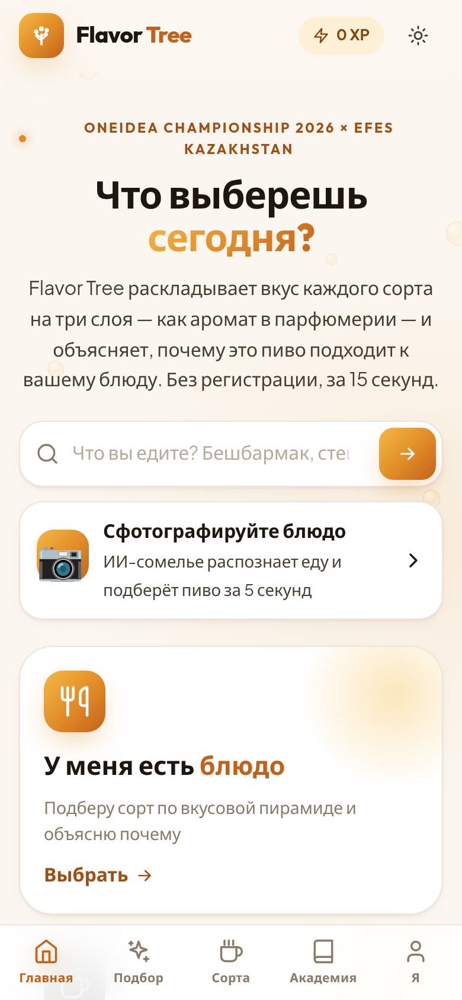
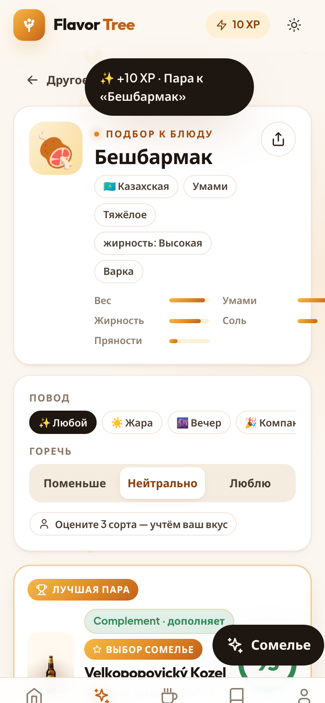
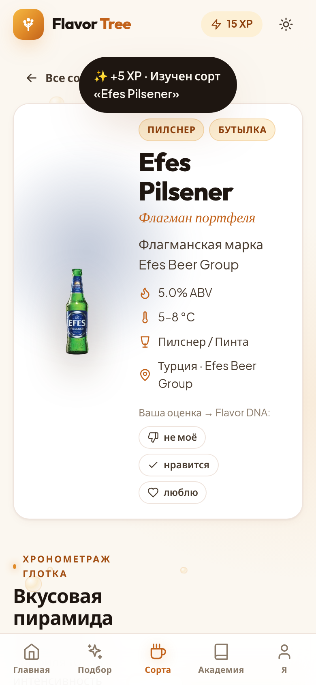

# 🍺 Flavor Tree v2

> *«Don't just drink — listen to the flavor»*

**Первая в СНГ платформа сенсорного образования для пива.** 17 сортов Efes Kazakhstan разложены на
вкусовую пирамиду (Top / Heart / Base), а объяснимый движок подбирает пиво к 50 блюдам шести кухонь —
от бешбармака до тирамису — и говорит, **почему**. Без приложения и регистрации: QR на столе → браузер → ответ за 15 секунд.

**OneIdea Championship 2026 × Efes Kazakhstan** · команда: Аджибаева Аделия, Абуталифулы Ералы

| Главная (телефон) | Результат подбора | Пирамида сорта |
|---|---|---|
|  |  |  |

---

## Что умеет

* **Подбор пива к блюду** — из базы 50 блюд (поиск с синонимами: «бесбармак», «кебаб», «ролл») или «своё блюдо»
  за 4 шага (вкус → сытность/жирность → способ готовки → острота). Контекст: повод (жара / вечер / компания / гастро),
  отношение к горечи, личный Flavor DNA, карта заведения.
* **Объяснение каждой пары** — оценка 3–99, тип (Complement / Contrast / Cleanse / Bridge), три причины словами,
  предупреждения, температура и бокал, полный разбор по 15 правилам с баллами.
* **Обратный подбор** — от сорта к блюдам, похожие сорта.
* **Каталог 17 сортов** — вкусовая пирамида в трёх визуализациях (бокал / дерево / радар), подача, «карта вкусов» горечь × тело.
* **Flavor DNA** — оцени сорта → вектор вкуса → один из 5 архетипов → рекомендации → карточка для сторис (PNG).
* **Школа сомелье** — 4 ступени, 12 уроков, 20 вопросов, XP, дневные серии, именной сертификат с QR (5000 XP).
* **HoReCa / QR** — `/qr/EBG-05`: гость за столом 5 в Efes Beer Garden видит меню заведения и подбор только из того, что на кранах.
* **Панель сомелье** — редактор пирамид с живым пересчётом рекомендаций, песочница движка, генератор QR для столов.
* **PWA, тёмная тема «вечерний бар», офлайн** — весь подбор считается в браузере.

## Движок подбора — коротко

```
пирамида сорта ──► вектор пива (10 осей: горечь, тело, солод, пузырьки, хмель, обжарка, крепость, карамель, фрукты, чистота)
разметка блюда ──► вектор блюда (13 осей: соль, сладость, кислота, умами, острота, жир, вес, дым, корочка, свежесть, сливочность…)
15 правил гастрономии (интенсивность · жир+горечь=очищение · острое не любит хмель · десерт не слаще пива ·
мосты ароматов · вердикт сомелье · повод · Flavor DNA) ──► Σ ──► score = 30 + 0.9·Σ
```

Один алгоритм в двух реализациях — Python (`backend/api/pairing/engine.py`, API) и TypeScript
(`frontend/src/app/engine/pairing-engine.ts`, офлайн). Паритет проверяется golden-тестом: 874 проверки, 0 расхождений.
30 unit-тестов, согласие с кураторскими парами сомелье: 100% пар 5/5 в топ-3. Подробно — [docs/PAIRING_ENGINE.md](docs/PAIRING_ENGINE.md).

## Быстрый старт

### Фронтенд (Angular 18) — работает без бэкенда
```bash
cd frontend
npm install
npm start                 # http://localhost:4200
npm run build             # production → dist/frontend/browser
npm run test:engine       # паритет TS-движка с Python по golden
npm run shots             # скриншоты mobile+desktop → docs/screenshots (нужен Google Chrome)
```

### Бэкенд (Django 4.2 + DRF) — SQLite по умолчанию, PostgreSQL через `DATABASE_URL`
```bash
cd backend
python3 -m venv .venv && .venv/bin/pip install -r requirements.txt
.venv/bin/python manage.py migrate
.venv/bin/python manage.py load_flavor_data      # ноты, 17 сортов, 50 блюд, 51 пара, курсы, заведения, QR-столы
.venv/bin/python manage.py runserver             # http://127.0.0.1:8000/api/
.venv/bin/python -m unittest api.tests.test_engine
```
Чтобы SPA брала данные и сохраняла правки сомелье через API, задайте в `frontend/src/index.html`:
`<script>window.FT_API_URL = 'http://127.0.0.1:8000/api'</script>`.

### CLI движка
```bash
cd backend && .venv/bin/python -m api.pairing.cli beshbarmak --occasion hot
.venv/bin/python -m api.pairing.cli --beer legenda-777
```

## Структура

```
data/          единый источник правды (JSON): ноты, сорта+пирамиды, блюда, пары, приоры, академия, заведения, golden
scripts/       build_data.py (генерация data/ из CSV + справочников), engine_golden.py
backend/       Django API · api/pairing/ — движок · views_engine.py — /api/pairing, /api/dna, /api/qr
frontend/      Angular 18 · engine/ · core/ (сервисы) · ui/ (компоненты) · pages/
docs/          PAIRING_ENGINE · ARCHITECTURE · API · MOBILE_DESIGN · screenshots/
```

Подробнее: [docs/ARCHITECTURE.md](docs/ARCHITECTURE.md) · [docs/API.md](docs/API.md) · [docs/MOBILE_DESIGN.md](docs/MOBILE_DESIGN.md).

## Маршруты SPA

| Путь | Что |
|---|---|
| `/` | главная: поиск блюда, два входа (блюдо / пиво), сценарии, как работает, факты |
| `/pair` → `/pair/:dish` | мастер подбора → результаты с контекстом; `/pair/custom?taste=…` — своё блюдо |
| `/beers` → `/beers/:id` | каталог и карта вкусов → бокал / дерево / радар, к чему подать, похожие |
| `/dishes` | 50 блюд по кухням |
| `/academy` → `/academy/:level` | ступени, XP, сертификат → уроки и квиз |
| `/dna` | Flavor DNA |
| `/qr/:token` | вход по QR со стола (`EBG-01…12`, `B13-01…08`, `SKR-01…10`) |
| `/admin` | панель сомелье |
| `/about` | питч: проблема, решение, бизнес, impact, ask, roadmap |

## Деплой

**Vercel (фронтенд):** Root = репозиторий, Build Command `cd frontend && npm ci && npm run build`,
Output `frontend/dist/frontend/browser`. `frontend/vercel.json` содержит SPA-rewrite.
**Бэкенд:** любой хостинг с Python; переменные `DATABASE_URL`, `DJANGO_SECRET_KEY`, `DJANGO_DEBUG=False`,
`DJANGO_ALLOWED_HOSTS`, `CORS_ALLOWED_ORIGINS`.

## Что дальше (roadmap)

Q4 2026 — дегустация 17 сортов с сомелье Efes (сейчас пирамиды и часть ABV — черновик, помечено `abv_estimated`),
пилот в 3 заведениях Алматы · Q1 2027 — kk/en, Kozel Dark и сезонные сорта · Q2 2027 — AI Food Scanner (фото → вектор блюда).

## Материалы OneIdea

`research.md` — CustDev (n=20) · `Flavor_Tree_Roadmap.pdf`, `GANTT.pdf`, `Lean Canvas.pdf`, `🍺 FLAVOR TREE.pdf` — питч-документы ·
`1 version/`, `2 version/` — предыдущие итерации кода (архив).

---
*© 2026 Flavor Tree. OneIdea Championship · Efes Kazakhstan · Anadolu Group.*

---

## Что нового · 18.09.2026 — продукт для баров и ИИ-сомелье

### Для заведений (SaaS) → [docs/SAAS.md](docs/SAAS.md), продажи → [docs/SALES.md](docs/SALES.md)
* **Гостевое меню `/m/<slug>/<стол>`** — брендинг заведения, *их* цены, стоп-лист, подбор пива только из *их* карты, кнопка «Заказать» (событие для владельца). QR **и NFC** (Web NFC запись из кабинета).
* **Кабинет `/cabinet`** — регистрация с 14 днями пробного, редактор карты и цен, стоп-лист в один клик, столы + печать стендов A6, аналитика: сканы по дням, конверсия, топ связок, **эффект подбора в ₸**.
* **Лендинг `/business`** — боль → решение → калькулятор окупаемости → тарифы (14 900 / 34 900 / 89 000 ₸) → заявка.
* Работает **без бэкенда** (демо на Vercel, localStorage) и с Django (`/api/cabinet/*`, `/api/menu/<slug>/`, `/api/track/`, `/api/leads/`). Демо-вход: `efes@demo.flavortree.kz / flavor2026`.

### ИИ-сомелье → [docs/AI.md](docs/AI.md)
* **`/scan` — сфотографируй блюдо**: Claude распознаёт еду и её сенсорный профиль → движок считает пары → Claude объясняет как сомелье. ИИ не «угадывает пиво» — он переводит гостя на язык движка и обратно, поэтому всё объяснимо и никогда не советует сорт, которого нет на кранах.
* **Чат «Сомелье»** на подборе, результатах и в гостевом меню: «что взять к мантам, не люблю горькое».
* Vercel Function `frontend/api/ai.ts` (для демо) и Django `POST /api/ai/` — один контракт. Нужен `ANTHROPIC_API_KEY`.

### Данные
* Колесо вкусов расширено до **64 нот** (Meilgaard/ASBC: банан, тропические фрукты, бисквит, тоффи, дым, минеральность… + 8 off-flavours для Академии).

### Запуск
```bash
# backend
cd backend && .venv/bin/python manage.py migrate && .venv/bin/python manage.py load_flavor_data && .venv/bin/python manage.py seed_saas --events 420
ANTHROPIC_API_KEY=sk-ant-… .venv/bin/python manage.py runserver
# frontend (демо без бэкенда — просто ng serve; ИИ через /api/ai работает на Vercel)
cd frontend && npm i && npm run build && npm run smoke
```
Vercel: Root Directory = `frontend`, Environment Variables → `ANTHROPIC_API_KEY`. Контакты для лендинга: `frontend/src/app/core/contact.ts`.

### Проверка
`npm run build && npm run test:engine && npm run smoke && node scripts/ai-dryrun.mjs && npx tsc -p tsconfig.api.json` · `python -m unittest api.tests.test_engine` · `python3 scripts/engine_golden.py`

План до финала: [docs/PLAN_3_WEEKS.md](docs/PLAN_3_WEEKS.md)
